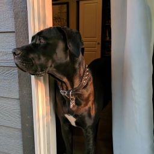
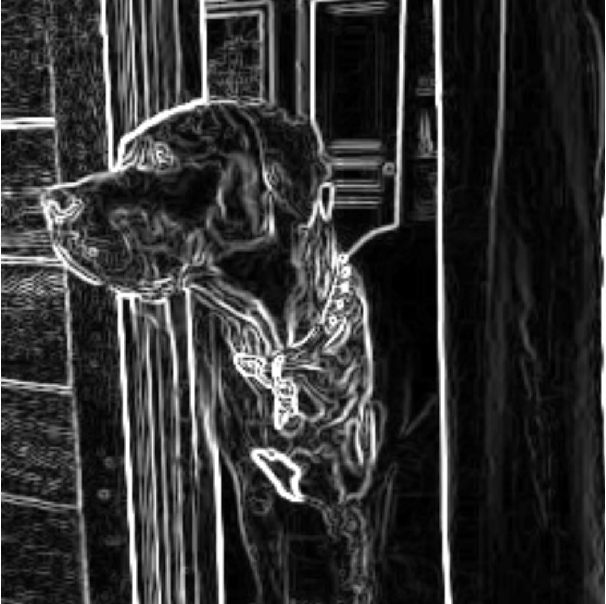
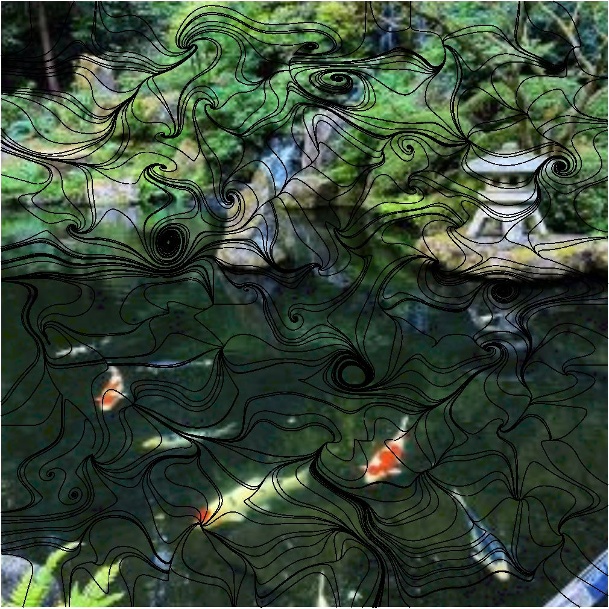
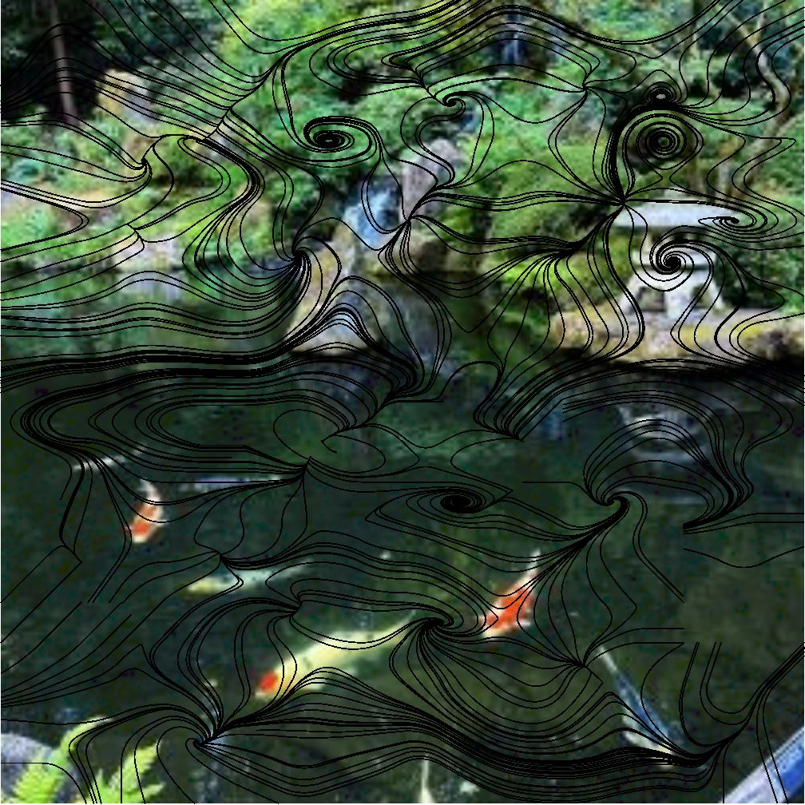
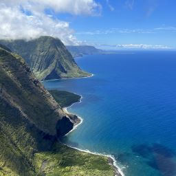
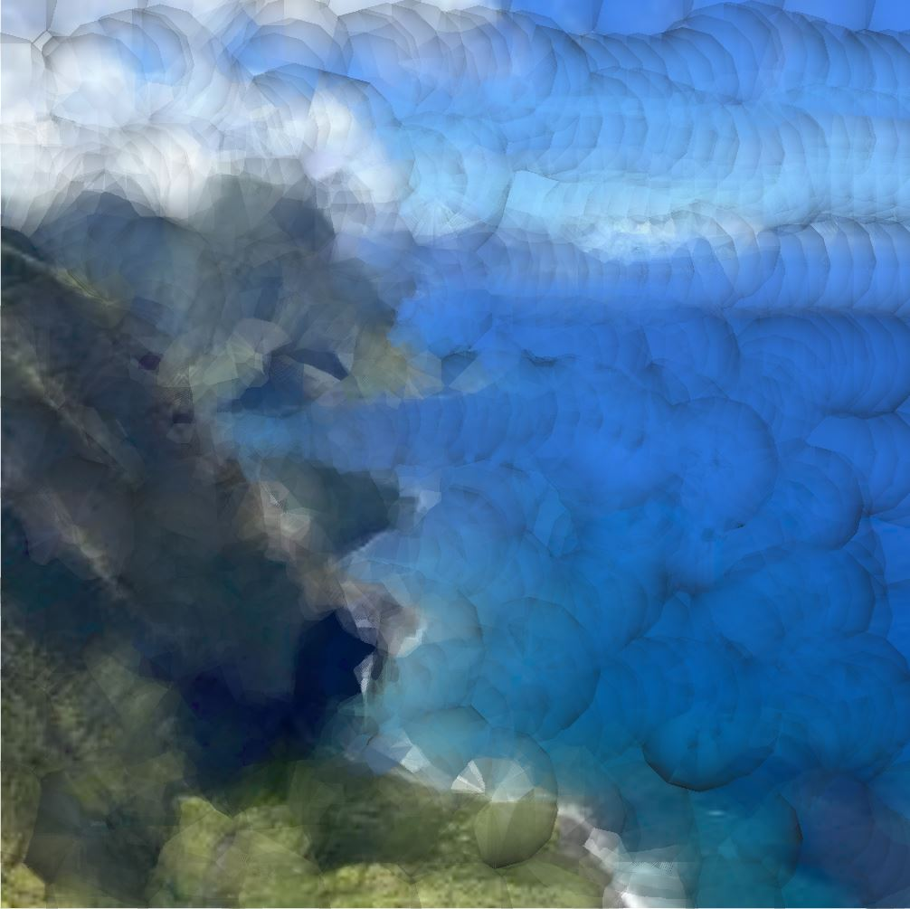

# Generating and Manipulating Painterly Renderings of Images

This is the code for my Honors undergraduate thesis project at Oregon State University!

We present a tool that converts any image into a painterly rendered one, or one that looks as though it was hand-painted. To do this, we implemented the Sobel filter to calculate the edge field that is used to create streamlines, which serve as the foundation for brush strokes. We implement a simple user interface that allows users to apply four different artistic styles to the image, including watercolor, impressionism, expressionism, and pointillism. In addition to providing default styles for an image, the system allows the user to adjust a few stylistic parameters regarding the brush strokes (width, color, opacity, etc.) to provide additional control over the rendered output. These brush strokes are then composited to create the final painterly rendering. This paper also analyzes a few key elements of what could be considered an effective painterly rendering based on the composition of four unique input images. We rely on subject size, position, and overall contrast of an image to determine its influence of each default painterly rendering.

## Sobel Filter

The final rendering of the image-- particularly the direction and quantity of the brushstrokes-- is based on the computed edge field of the original image. This is done through edge detection, more specifically using the Sobel filter. The Sobel filter takes an image as input and creates a new image with emphasized edges. The image is then convolved with the Sobel kernels in both the horizontal and vertical directions. In terms of image processing,convultion refers to a 3x3 matrix of surrounding pixels, which are used to compare the change of intensity in the selected pixel in any given direction. This intensity change is used to compute the gradient vector for that pixel, which points in the direction of the greatest change in intensity.The figure below demonstrates how the edges of an original image are extracted and displayed on a black background:

 

## Streamline Creation

Streamlines in computer graphics and visualization are used to denote the contours of the subjects in the input image. The resulting edge field from the Sobel operation will be used as the foundation for creating streamlines. Our methodology for this algorithm is similar to that of \cite{hertzmann}. We implement these streamlines by mapping the Sobel filter texture onto the mesh, so that we have quads and vertices from which to reference for our streamline creation.

The gradient vectors of the calculated edge field determine the direction of each of the initial streamlines, but we need to create a reference image from which we can determine the length of each streamline. Since our brush strokes will each be a solid color, we do not want our streamlines to exceed the length across more than a single color. The reference image from which we compute length and sample color will be our original image with a Gaussian blur applied, which will allow us to average the colors of pixel neighborhoods in order to compute significant color changes. The figures below demonstrate streamlines for the same image, one without smoothing (left) and one with smoothing (right):

 

We begin this process by taking a vertex in the mesh space and convert its values to find its position in the texture space. Once we have found that point on the texture, we can sample the magnitude vector at that texel, which was derived by using the Sobel filter. We use this vector to find the next point on the line, the coordinate at which the vector is pointed. These coordinates are then converted to the mesh space, and the two points in the mesh space are used to derive the vector at the control vertex on the mesh. When all of the vectors for the image have been found, and all of the streamlines are drawn, the brush stroke stylization can take place. The resulting streamlines will be used for the general position and direction of the painting's brush strokes.

When the conversion from pixel to vertex space is established, the streamlines can then be calculated. We implement our streamlines via the fourth-order Runge-Kutta algorithm. The algorithm itself is fairly straightforward: informally, we start at a control vertex on the image, and continue in the direction which is normal to the vector gradient. If the normal points to the inside of a quad-- that is, not directly at another vertex-- then we add its vector to the streamline through bi-linear interpolation. This is continued until there are no more nonzero vectors on the path of the streamline, at which point we begin the process over again to back trace the streamline from the initial vertex. Later in this process, when we stylize brushstrokes over these streamlines, the streamline will be broken into brush strokes of varying lengths, with maximum and minimum lengths implemented as style parameters. 

## Brushstroke Creation & stylization

Once the streamlines for the image or video have been derived, we then take the collection of streamlines and stylize them to simulate the brush strokes of a paintbrush.

Within the context of this application, stylization of brush strokes refers but is not limited to the size, shape, color, and opacity of the brush stroke. These qualities can be determined by the user, which will ultimately allow them to customize a unique painterly rendering of an image. Depending on these style parameters, the user is also able to emulate a variety of painting styles such as Pointillism, Impressionism, Watercolor or Expressionism from the same original image.

Brush strokes are applied by drawing discs at each step of the calculated streamline. The collective rendering of discs for a single streamline dictates a single brush stroke; however, there is also the option of drawing the discs sufficiently far apart such that the discs are implemented as their own brush strokes. This can be particularly effective in watercolor images (seen below), where the brush strokes tend to be more blotted. Our final brush stroke style is determined by either the provided user input or the default values. Regardless of the stylization applied to the brush strokes, the final brush strokes are rendered over the original image. This allows more transparent brush strokes to maintain a finer level of detail by blending the brush stroke with the original image underneath.

 

## For more information, you can find my thesis paper under the directory `ThesisPaper`.

Source code provided by mentor Dr. Eugene Zhang, Jinta Zheng, and Xinwei Lin.
