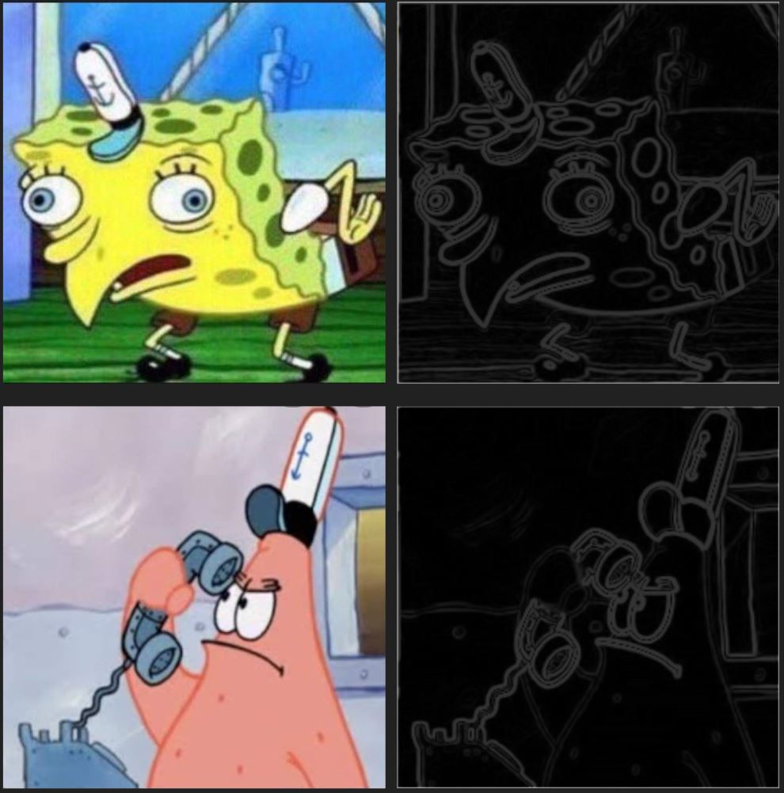
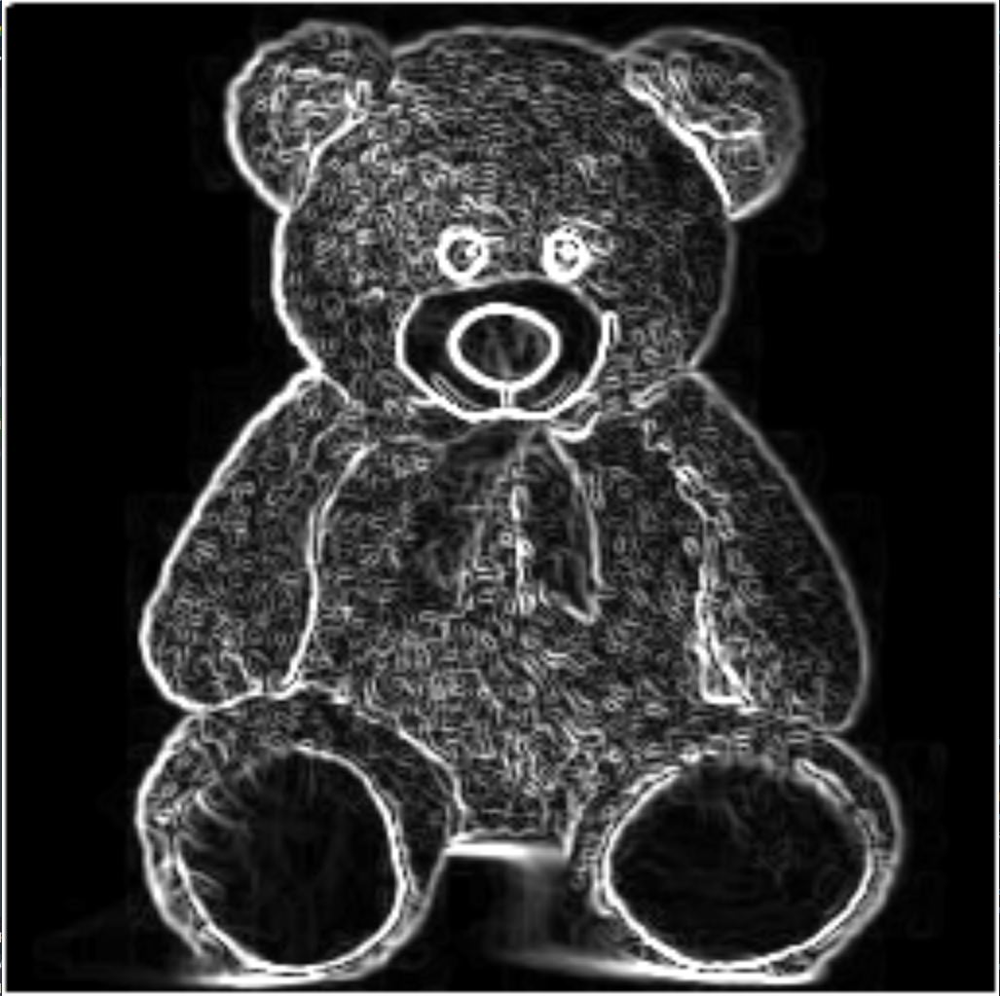
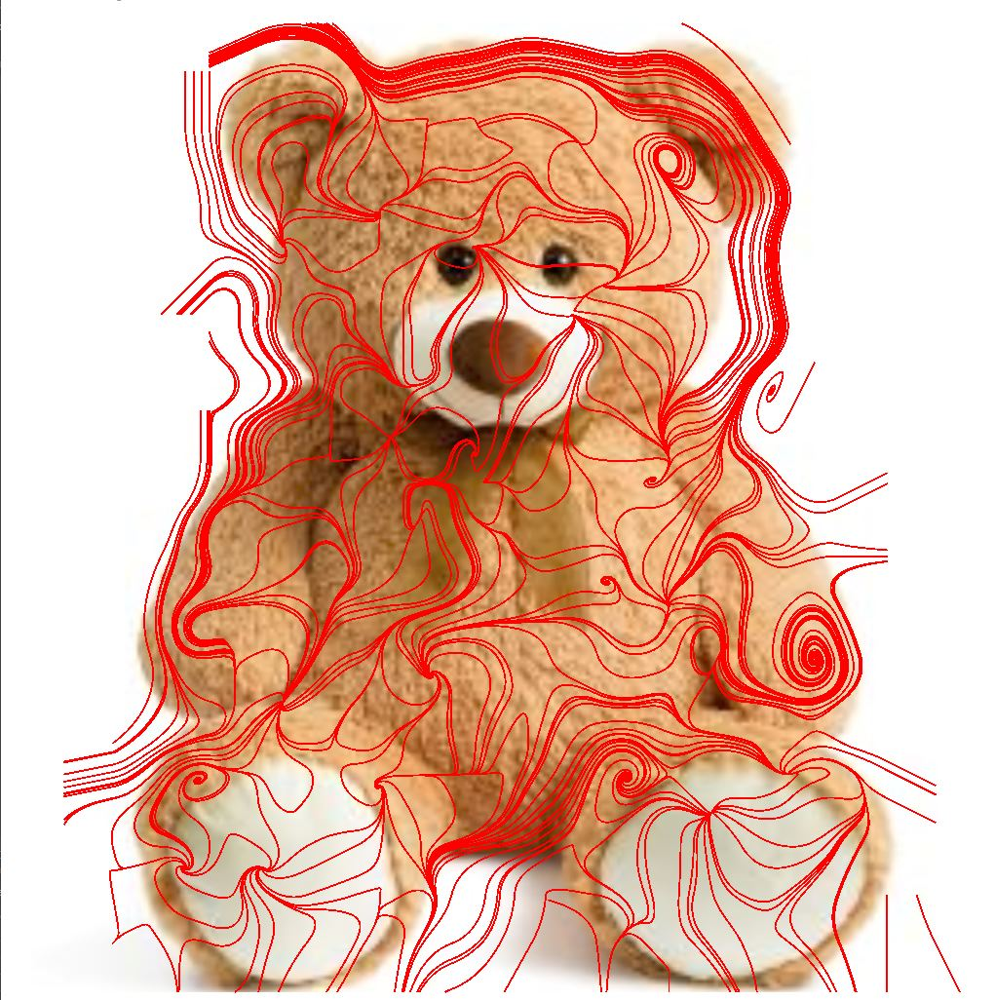

# Generating and Manipulating Vector Fields on 2D Surfaces

Current progress on Honors undergraduate thesis project. Aiming to create an application that allows a "painterly rendering" of an image or video as input.

We present a tool that converts any image or video into a painterly rendered one, or one that looks as though it was hand-painted. To do this, we implemented the Sobel filter to detect the directional fields that are used to create the direction of the brush strokes. The system allows the user to adjust a few stylistic parameters regarding the brush strokes (width, color, texture, etc.) to provide the user with additional control over the rendered output. These brush strokes are then composited to create the final painterly rendering. This system will be valuated by a handful of users, and their feedback will ultimately be used to simplify the user interface.

## Sobel Filter

The first aspect of this project is the Sobel filter, which will be used to generate the streamlines used for brush strokes. The Sobel filter takes an image as input and creates a new image with emphasized edges. In this process, the gradient vector field of the input image is approximately computed in order to determine the intensity for each pixel. The image is then convolved with the filter operator in both the horizontal and vertical directions. In terms of image processing, convolution refers to a 3x3 matrix of surrounding pixels, which are used to compare the change of intensity in the selected pixel in any given direction. This intensity change is used to compute the gradient vector for that pixel, which points in the direction of the greatest change in intensity. For example, these images from Spongebob will present the following results when the Sobel operator is applied:

## Streamline Creation

Streamlines in computer graphics and visualization are used to denote the contours of the subjects in the input image. The resulting edge field from the Sobel operation will be used as the foundation for creating streamlines. Our methodology for this algorithm is similar to that of \cite{hertzmann}. We implement these streamlines by mapping the Sobel filter texture onto the mesh, so that we have quads and vertices from which to reference for our streamline creation.

The gradient vectors of the calculated edge field determine the direction of each of the initial streamlines, but we need to create a reference image from which we can determine the length of each streamline. Since our brush strokes will each be a solid color, we do not want our streamlines to exceed the length across more than a single color. The reference image from which we compute length and sample color will be our original image with a Gaussian blur applied, which will allow us to average the colors of pixel neighborhoods in order to compute significant color changes. 

 

We begin this process by taking a vertex in the mesh space and convert its values to find its position in the texture space. Once we have found that point on the texture, we can sample the magnitude vector at that texel, which was derived by using the Sobel filter. We use this vector to find the next point on the line, the coordinate at which the vector is pointed. These coordinates are then converted to the mesh space, and the two points in the mesh space are used to derive the vector at the control vertex on the mesh. When all of the vectors for the image have been found, and all of the streamlines are drawn, the brush stroke stylization can take place. The resulting streamlines will be used for the general position and direction of the painting's brush strokes.

When the conversion from pixel to vertex space is established, the streamlines can then be calculated. We implement our streamlines via the fourth-order Runge-Kutta algorithm. The algorithm itself is fairly straightforward: informally, we start at a control vertex on the image, and continue in the direction which is normal to the vector gradient. If the normal points to the inside of a quad-- that is, not directly at another vertex-- then we add its vector to the streamline through bi-linear interpolation. This is continued until there are no more nonzero vectors on the path of the streamline, at which point we begin the process over again to back trace the streamline from the initial vertex. Later in this process, when we stylize brushstrokes over these streamlines, the streamline will be broken into brush strokes of varying lengths, with maximum and minimum lengths implemented as style parameters. 

## Brushstroke Creation & stylization

This part has not been implemented yet.

Source code provided by mentor Dr. Eugene Zhang, Jinta Zheng, and Xinwei Lin
